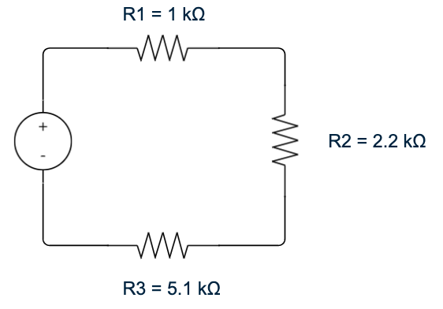
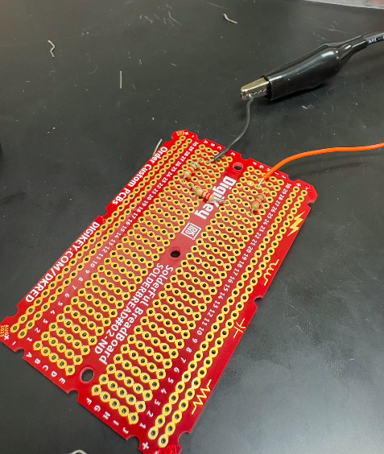
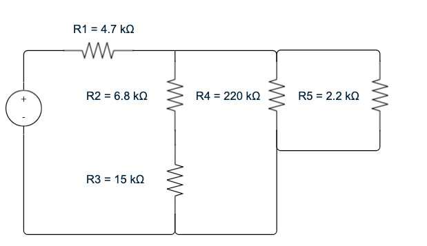
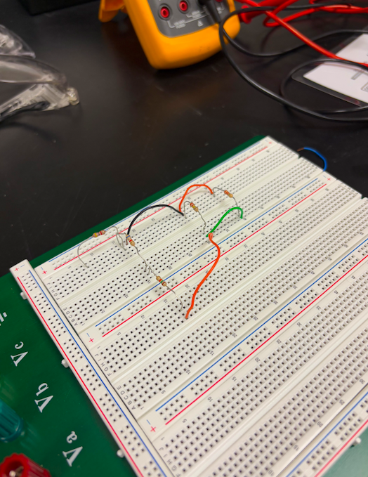
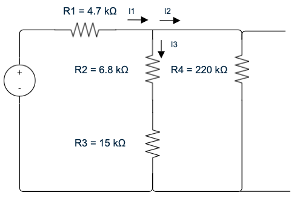
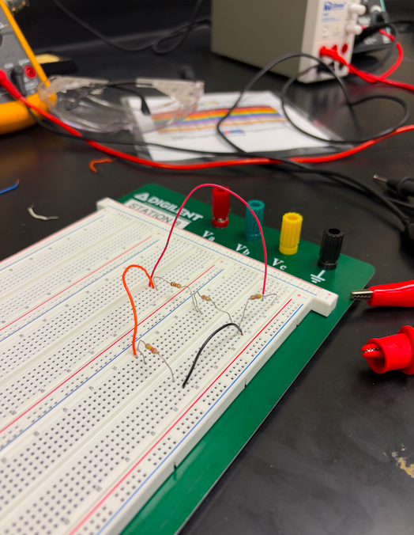

# Lab 2: For Good Measure

## Authors: Ashlyn Lippert and Seth Daniel

## Date: February 9th, 2025

## Introduction:
   The goal of this project was to analyze electrical circuits by applying fundamental circuit laws, including Kirchhoff’s Voltage Law (KVL), Kirchhoff’s Current Law (KCL), and Ohm’s Law. The analysis also incorporated Thevenin’s and Norton’s theorems, along with the superposition principle, to simplify complex circuit calculations. Additionally, the project required hands-on circuit assembly and soldering, reinforcing practical skills essential for electrical and electronic work.
   As part of this project, a series circuit was soldered and a prototype parallel circuit was assembled to experimentally verify theoretical principles. Measurements of voltage and current were taken using appropriate instruments, and the collected data was compared against theoretical predictions based on circuit laws. The soldering process provided valuable hands-on experience, highlighting the importance of precision in electronic assembly. Overall, the project enhanced both theoretical understanding and practical skills in electrical circuit analysis.

## Materials:
1. Soldering station
2. Solder Protoboard
3. Small piece of solder
4. Resistors: 1kΩ, 2.2 kΩ, 2.2 kΩ, 5.1 kΩ, 4.7 kΩ, 6.8 kΩ, 15 kΩ, 220 kΩ
5. DC Power Supply (DCPS)
6. Fluke 87 V DMM
7. Wire trimmers
8. Breadboard
9. Additional wires

## Assembly Methods:

**Objective 1: Learn soldering techniques by building a simple circuit on a solder protoboards**

1. **Series Circuit Assembly:**
   
   The circuit constructed for this portion of the lab is described by the following schematic in Figure 1. The 1kΩ (R1), 2.2kΩ (R2), and 5.1kΩ (R3) resistors were placed in series on the protoboard, then the leads of the resistors were trimmed down using wire cutters and folded against the protoboard.

  
  
<b>Figure 1:</b> Schematic describing the series resistor circuit built for part 1 of this lab.

   Once the circuit was verified to be correct, we used the soldering station set to 650 degress to solder the resistors to the protoboard. The soldering technique we used can be described by the following diagram from Techspray.

 

  
  
<b>Figure 2:</b> Soldering Technique used by our lab group to solder the series circuit. Retrieved from TechSpray.

   The resistors were soldered by placing the soldering iron on the designated solder point, then after a couple seconds, introducing the solder material to the same point. Once the solder is liquefied, the iron was used to ensure the solder is in the appropriate location and covering the resistor leads. The same process was used for each resistor lead. Each partner performed 3 resistor lead solders on the protoboard. Additionally, one end of two separate wires were soldered to the terminals of R1 and R3 for DCPS connection. The finished soldered series circuit is provided in the figure below. 

   

  
  
<b>Figure 3:</b> Top view of soldered series resistor circuit.

**Objective 2: Analyze a circuit to verify Kirchhoff’s Voltage Law (KVL) and Kirchhoff’s Current Law (KCL), and apply Thevenin’s and Superposition Theorems**

1. **Series Circuit**

   Utilize the soldered series circuit prepared in Objective 1.
   
2. **Parallel Circuit**

   Obtain the following resistors: 4.7 kΩ (R1), 6.8 kΩ (R2), 15 kΩ (R3), 220 kΩ (R5), and 2.2 kΩ (R5 = RL) and verify their resistance value (if not already performed in Objective 1). Refer to the schematic given in Figure 4 for assembly instruction.

   

  
  
<b>Figure 4:</b> Parallel resistor circuit schematic for part 2 of this lab.

   No soldering is necessary for this circuit, but verification of the DCPS voltage output was performed using the DMM to ensure the voltage is within .1V of the expected output. Once assembled, the circuit should look like the following:

   

  
  
<b>Figure 5:</b> Assembled series resistor circuit for part 2 of this lab.

3. **Thevenin and Norton**

   Thevenin’s Theorem states that all linear circuits can be expressed as a circuit with one equivalent voltage source and one equivalent resistance. To create the Thevenin equivalent circuit, remove R5 from the parallel circuit assembled in the previous step of Objective 2. The schematic for the Thevenin circuit is shown in Figure 6 below.

   

  
  
<b>Figure 6:</b> Thevenin equivalent circuit schematic.

   When assembled, the Thevenin circuit should resemble the image below.

   

  
  
<b>Figure 5:</b> Assembled Thevenin resistor circuit for part 2.3 of this lab.

## Test Equipment:
1. Fluke 87 V DMM
2. DC Power Supply
   
## Test Procedures:

**Objective 1: Use the above-listed lab equipment to measure and verify equipment, component, and
circuit values**

1. **Resistor Value Verification:**
   
   Identified resistors needed for each circuit and recorded their color codes to determine expected values, then we used a Fluke 87 V DMM to measure the actual resistance by connecting the alligator clips to each resistor's leads.
   We then compared the measured values with expected values and checked if they were within tolerance.

2. **DCPS Output Verification:**
   
   To verify the voltage output of the DCPS, the DMM leads were connected to the output cables of the DCPS. Red was connected to red, and black was connected to black.
   The measured voltage output was then compared to the expected output voltage manually set on the DCPS.

5. **Function Generator Output**

   We set the function generator to produce a 2kHz sine wave at maximum amplitude and measured the output using multiple methods. These included:
      - Counting squares on the oscilloscope screen
      - Using the oscilloscope’s moveable cursors
      - Utilizing the oscilloscope’s built-in measurement functions
      - Measuring the signal with the DMM
  

  
  
<b>Figure 4:</b> Setup for 2 kHz sine wave generation on function generator.

  
  
<b>Figure 5:</b> Sine wave output generated on oscilloscope from generated function.

**Objective 2: Learn how to use GitHub for collaboration and to post your report**

## Test Results:
| Resistance of DMM Cables (Ohms) |
|---------------------------------|
|          1.2                    |

**Resistor Values:**

| Resistor # | Band 1 | Band 2 | Band 3 | Band 4 | Expected Resistance (Ohms) | Tolerance | Max Value (Ohms) | Min Value (Ohms) | Measured Resistance (Ohms) | Measured Resistance - Resistance of Cables (Ohms) |
|------------|--------|--------|--------|--------|--------------------------|-----------|----------------|----------------|----------------------|---------------------------------|
| 1          | Yellow | Purple | Green  | Gold   | 4700000                  | 5%        | 4935000        | 4465000        | 4720000              | 4719998.8                         |
| 2          | Brown  | Green  | Black  | Gold   | 15                        | 5%        | 15.75          | 14.25          | 15.7                  | 14.5                               |
| 3          | Brown  | Gray   | Brown  | Gold   | 180                       | 5%        | 189            | 171            | 187                   | 185.8                              |
| 4          | Gray   | Red    | Red    | Gold   | 8200                      | 5%        | 8610           | 7790           | 8230                  | 8228.8                             |

**Capacitor Values:**
| Capacitor # | Capacitor Type | Expected Capacitance (F) | Tolerance | Max Expected Capacitance (F) | Min Expected Capacitance (F) | Measured Capacitance (F) |
|-------------|----------------|--------------------------|-----------|------------------------------|-------------------------------|---------------------------|
| 1           | Electrolytic   | 0.00047                  | 20%       | 0.000564                        | 0.000376                     | 0.00053                  |
| 2           | Ceramic        | 0.000001                 | 5%        | 0.00000105                      | 0.00000095                    | 0.00000114               |
| 3           | Ceramic        | 2.2E-11                  | 5%        | 2.31E-11                        | 2.09E-11                      | 3E-10                    |
| 4           | Ceramic        | 0.000000001              | 10%       | 1.1E-09                         | 9E-10                         | 1.34E-09                 |

**Polarity Check for Electrolytic Capacitor:**
| DMM Lead #1 | DMM Lead #2 | Voltage Measurement (V) |
|-------------|-------------|-------------------------|
| Black       | Red         | 528                     |
| Red         | Black       | 528                     |

**Power Supply Voltage Verification:**
| Expected Current from DCPS (A) | Expected Voltage from DCPS (V) | DMM Voltage Measurement (V) |
|--------------------------------|--------------------------------|-----------------------------|
| 0                              | 1.5                            | 1.499                       |
| 0                              | 7                              | 7                           |
| 0                              | 12                             | 12                          |
| 0                              | 3.3/3.5                        | 3.417                       |

**Function Generator Output:**
|       Method        |  Wave Type  | Frequency (kHz) | Amplitude (V) |
|---------------------|-------------|-----------------|---------------|
| Counting Squares    | Sinusoidal  | 2.5             | 20            |
| Cursors             | Sinusoidal  | 2.267           | 20            |
| Measurement Feature | Sinusoidal  | 2.202           | 20.20         |
| DMM                 | Sinusoidal  | 2.2             | 7.16          |

## Discussion:

Discussion Question 1: Are the measured currents in agreement with Kirchhoff’s Current Law?

Seth provide response here

Discussion Question 2: Compare the measured values and the calculated values. Are these in
agreement with Kirchhoff’s Voltage Law?

Seth provide response here

Discussion Question 3: Calculate the power delivered by the power supply and the power
dissipated by every resistor. Is the power delivered by the power supply equal to the total power
dissipated?

Seth provide response here

Discussion Question 4: Using circuit analysis, calculate RTH, IN, and VTH, and compare them with
the measured values. Are the calculated values in agreement with the measured values?

Seth provide response here

## Conclusion:
